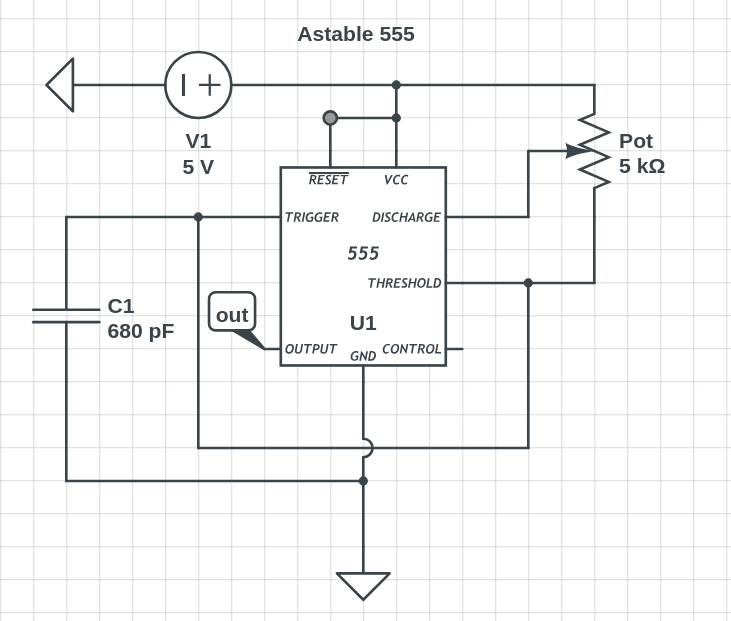

+++
title = 'Astable 555'
date = 2025-03-23T17:23:48-04:00
draft = true
+++

Been messing around with an astable 555 timer circuit in a configuration I found on the @learnelectronics channel on YouTube. The [video](https://youtu.be/VurDwrtTF3g?si=dYYxvPThZ2GutFrS) shows the configuration below.

