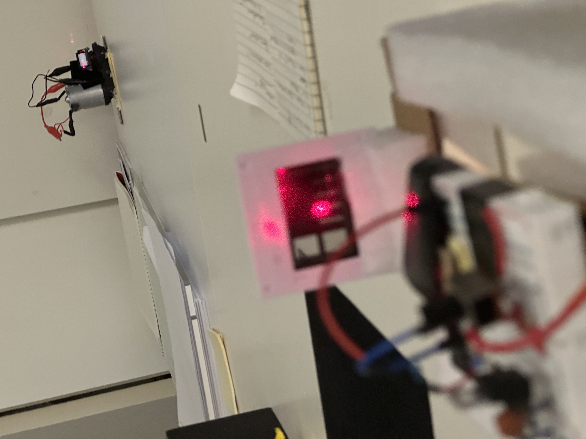
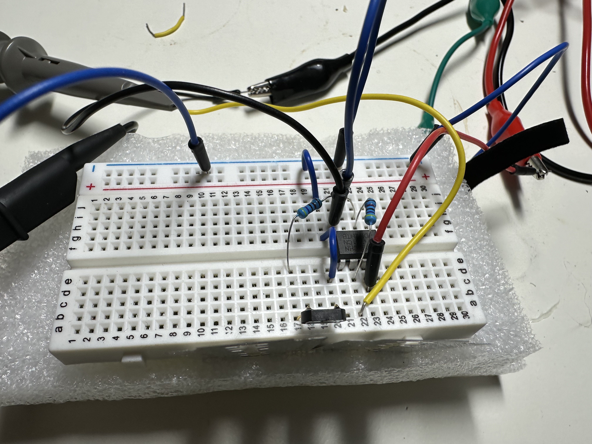
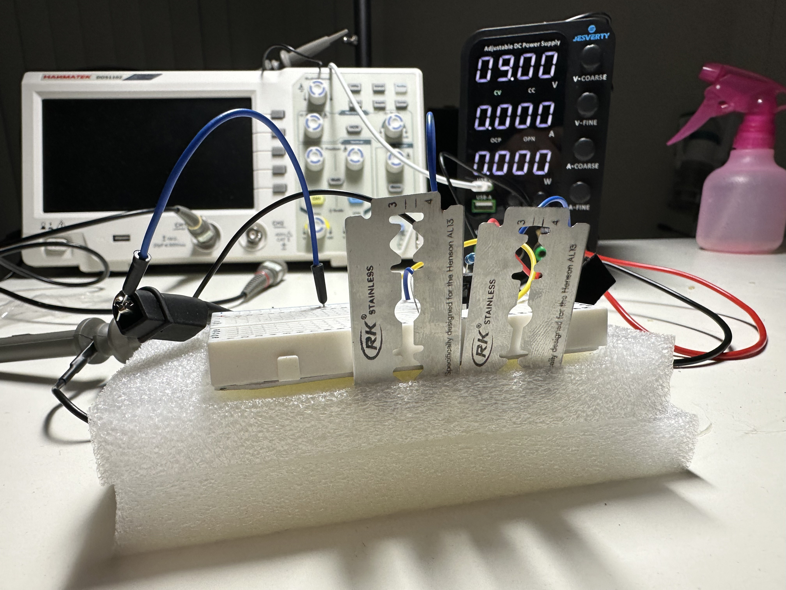
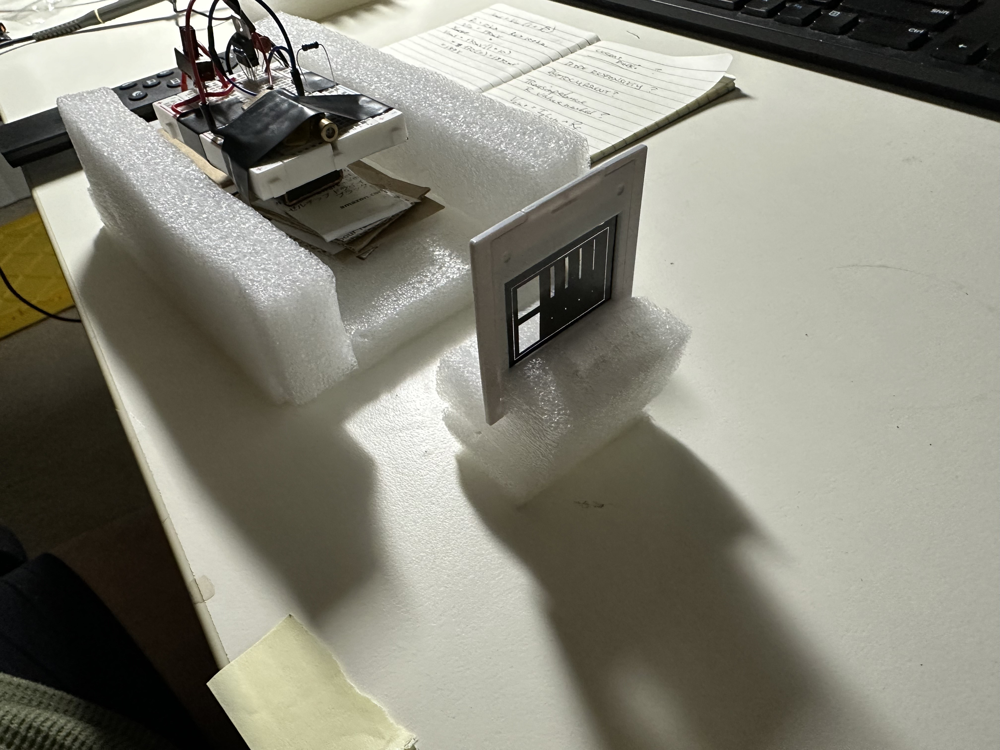
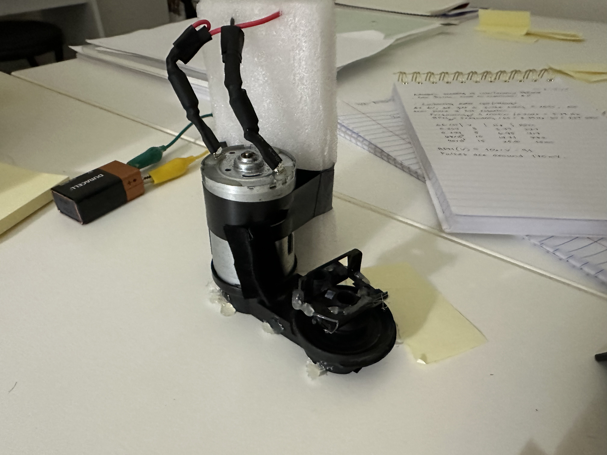
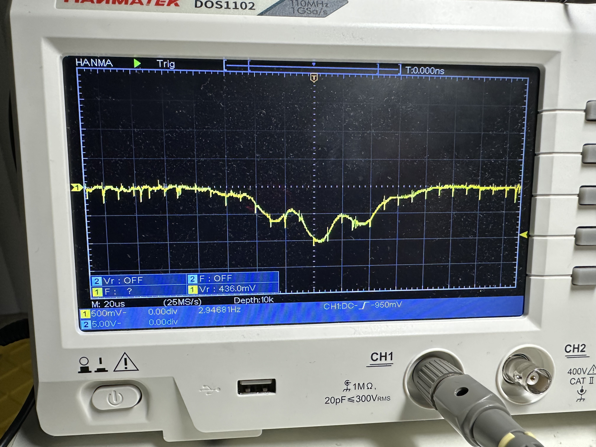

+++
title = 'Success! Automatic Scanning of Interference Patterns.'
date = 2025-03-19T10:37:30-04:00
draft = false
+++

Finally! I’ve been trying to get this experiment to work for a while but I the signal was always too weak. In class with Dr. Podzorov, we learned about op-amps so I figured I’d give it a shot to finally get this experiment working. It worked!

In David and Shanni Prutchi’s book Exploring Quantum Physics Through Hands-On Projects, one of the first experiments they describe is a way to automatically scan the interference pattern produced by something like a laser shining through a double-slit. This seems like a great idea since putting a ruler against the screen to measure tiny separations in fringes is a pain in the ass.

The laser shining through the double-slit onto the rotating mirror. You can see the diffraction pattern behind the mirror. This shows up because every time the mirror rotates part of it hits the wall behind.

The idea is that they use a fast rotating mirror to reflect the interference pattern toward a photo diode, which has a small window to block everything but the intensity at every fraction of a moment, which allows it to sense only the intensity of a small portion of the interference pattern as the mirror rotates.

Here’s a video showing when I finally got it to work: https://www.youtube.com/shorts/BEgxtvaL_QI

Anyway, I wont’ go through all of the details, the setup is described in the book. The biggest differences between what I did and the book is that:

1. I used a regular silicon photo-diode with an op-amp circuit to boost the signal rather than using the TAOS light to voltage converter;
2. My mirror was rotating at roughly 800 RPM rather than 4-8,000;
3. The slit that covers the photo-diode was not small, in fact it was nearly the size of the photo-diode itself. I’m not totally sure why this worked for me – I think it had to do with the RPM of the mirror.

Here are some pictures of the experimental setup and the results.

This is the op-amp circuit, you can see the diode and just barely see the two razor blades at the bottom of the breadboard.

View from the other side of the razor blades.

The laser (650nm) connected to a 9V battery (under breadboard) through a voltage regulator circuit. On the right is the diffraction mosaic. I used the double slit for this experiment (~0.3mm slit separation).

The scope showing the interference pattern (inverted due to the op-amp circuit).

The motor-mirror setup. This is a 25.9V motor that I ran with a 9V battery. I used the oscilloscope to measure the RPM at 9V and found it to be ~800. The mirror is from an old camera that I took apart and the motor came from some random junk appliance, can’t remember what it was.

Image of scope screen when the experiment is running with the lights off.

Anyway, that’s it for now. I plan to do this again with a proper light to voltage converter and some other adaptations to smooth out the signal. I’ll also probably make the setup a bit more durable and try some other wavelengths of light.
