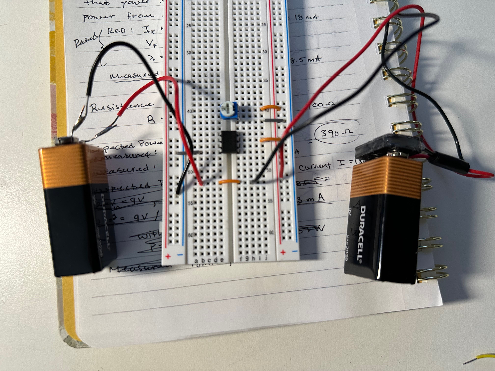

+++
title = 'Op Amp Battery Supply'
date = 2025-03-28T18:46:34-04:00
draft = false
+++
Here's a quick little picture of how to power a 741 op-amp with two 9V batteries. Just for reference. Included is the trim pot for offset null. This setup connects the batteries in series and the positive and negative rails are connected outside of the frame. You can see that the batteries create a virtual ground where they connect and this serves as the circuit's ground, while the blue rail serves as ~ -9V and the red rail as ~ +9V.

*circuit guided by @electronzapdotcom on YouTube*

