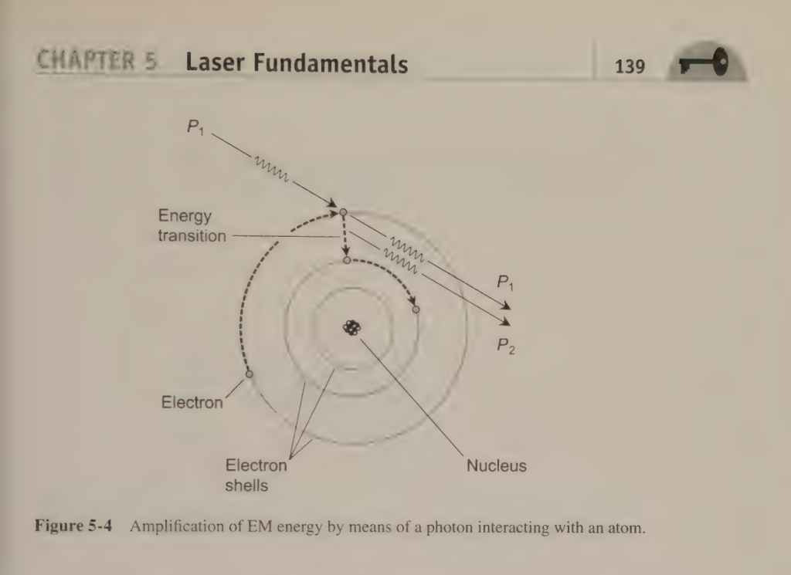

+++
title = 'Pop Inversion Laser'
date = 2025-03-19T11:09:29-04:00
draft = false
+++

Population inversion has been a tricky concept for me. How can a photon, crashing into an electron, something that usually adds energy, actually cause the electron to lose energy?

This isn’t meant to be a rigorous treatment of this topic, but rather a helpful way to think about this intuitively so that it doesn’t feel so wrong.

In short, I think of this phenomenon by personifying the objects in question. Think of the electron as a lazy person sitting at home on their couch (this is energy level zero, or E_0).

The electron has a friend, a really bubbly fun photon, who desperately wants to go to a party. The photon calls the electron and pumps him up to go to this party. They’re so excited! They think this party is going to rock! This is energy level E_2.

They are severely disappointed when they get to the party. It’s super lame. Just nothing going on. They lose that party rocking energy and drop to a bored state (E_1). They want to leave, especially the photon. Being the fun-loving, outgoing photon that she is, she wants to go to another party! But her friend, the lazy electron, doesn’t want to go. He’s tired and wants to go home. So, there they sit. On the couch at a lame party. Both holding each other in a state of limbo because the photon can’t convince the electron to go to another party and the electron just wants to go home but stays because he doesn’t want to disappoint the photon.

All of a sudden, another photon shows up, all excited to have a crazy night! This new photon convinces the first photon to send the electron home and come out to get crazy! The two photons leave together and the electron goes back home (E_0).

I don’t know if this is a good way of thinking about it but for now it’s working for me.
